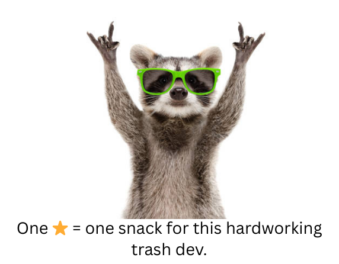

<!-- PROJECT SHIELDS -->

[](https://github.com/ZouariOmar/AgriGO/graphs/contributors)
[](https://github.com/ZouariOmar/AgriGO/network/members)
[](https://github.com/ZouariOmar/AgriGO/stargazers)
[](https://github.com/ZouariOmar/AgriGO/issues)
[](LICENSE)
[](https://www.linkedin.com/in/zouari-omar-143239283)

<h1 align="center">
  <br>
  <a href="https://github.com/ZouariOmar/Racognition"></a>
  <br>
  Racognition
  <br>
</h1>

<h6 align="center">Racognition is a high-performance face recognition system built using Python (or C++), designed to provide accurate and real-time facial identification and verification. Leveraging cutting-edge computer vision and machine learning techniques, Racognition can detect, analyze, and recognize faces from static images or live video streams. Whether for security, automation, or personalization, Racognition offers a scalable and efficient solution adaptable to various applications.</h6>

<p align="center">
  <a href="#"></a>
  <a href="#"></a>
  <a href="#"></a>
  <a href="#"></a>
  <a href="#"></a>
  <a href="#"></a>

</p>

<p align="center">
  <a href="#key-features">Key Features</a> •
  <a href="#how-to-use">How To Use</a> •
  <a href="#download">Download</a> •
  <a href="#credits">Credits</a> •
  <a href="#related">Related</a> •
  <a href="#license">License</a>
</p>


## Key Features

- 👁️ Face Detection with Haar Cascade: Utilizes OpenCV's Haar Cascade Classifier for efficient and reliable face detection in both images and video streams.
- 🧠 Face Recognition with LBPH: Implements the Local Binary Patterns Histograms (LBPH) algorithm for face recognition—known for its simplicity, speed, and accuracy in various lighting conditions.
- 🎥 Real-Time Recognition: Supports live video input via webcam or camera feed, allowing for real-time face detection and recognition.
- 📷 Image & Video Compatibility: Capable of processing both static images and video files for facial analysis.
- 🛠️ Built with OpenCV: Entirely developed using the OpenCV library, making it lightweight and highly compatible across platforms.
- 🧑‍🏫 Training Interface: Includes functionality to train the system with new faces, enabling custom datasets and personalized recognition.
- 🗃️ Data Management: Stores trained data and face samples for easy updates, backups, and reusability.
- 🔐 Ideal for Access Control: Can be integrated into security systems for identity verification, attendance tracking, or restricted access applications.

## How To Use

To clone and run this application, you'll need [Git](https://git-scm.com), [C++](https://isocpp.org), [Python](https://www.python.org) and [Qt6](https://www.qt.io) installed on your computer. From your command line:

```bash
git clone https://github.com/ZouariOmar/Racognition # Clone this repository
cd Racognition                                      # Go into the repository
```

For C++

```bash
cd C++                # Go to `C++` directory
chmod u+x run.sh      # Make `run.sh` executable
./run.sh build --root # Build project from the root
./run.sh run          # Run the project (See main.cpp)
```

For Python

```bash
cd Python                        # Go to `Python` directory
python -m venv .venv             # Make a virtual environment
source ./venv/bin/active         # Active the virtual environment
pip3 install -r requirements.txt # Install project requirements
python face_recognise.py         # Run the project (or choose another .py file)
```

## Download

You can [download](https://github.com/ZouariOmar/Racognition/releases) the latest installable version of Racognition for macOS and Linux.

## Emailware

Racognition is an [emailware](https://en.wiktionary.org/wiki/emailware). Meaning, if you liked using this app or it has helped you in any way, I'd like you to send me an email at <zouariomar20@gmail.com> about anything you'd want to say about this software. I'd really appreciate it!

## Credits

This software uses the following open source packages:

- [Qt6](https://www.qt.io)
- [CMake](https://cmake.org)
- [OpenCV (cv2)](https://opencv.org)
- [Python](https://www.python.org)
- [Arduino](https://www.arduino.cc)

## Related

- [QRME](https://github.com/ZouariOmar/QRME) - A QR code generator app
- [Tic Tac Toe](https://github.com/ZouariOmar/Tic-Tac-Toe) - A classic game built with SDL and C++

## License

MIT

---

<h1 align="center">
  <a href="https://github.com/ZouariOmar/Racognition"></a>
</h1>

> Linkedin [Zouari Omar](https://www.linkedin.com/in/zouari-omar-143239283) &nbsp;&middot;&nbsp;
> GitHub [@ZouariOmar](https://github.com/ZouariOmar) &nbsp;&middot;&nbsp;
